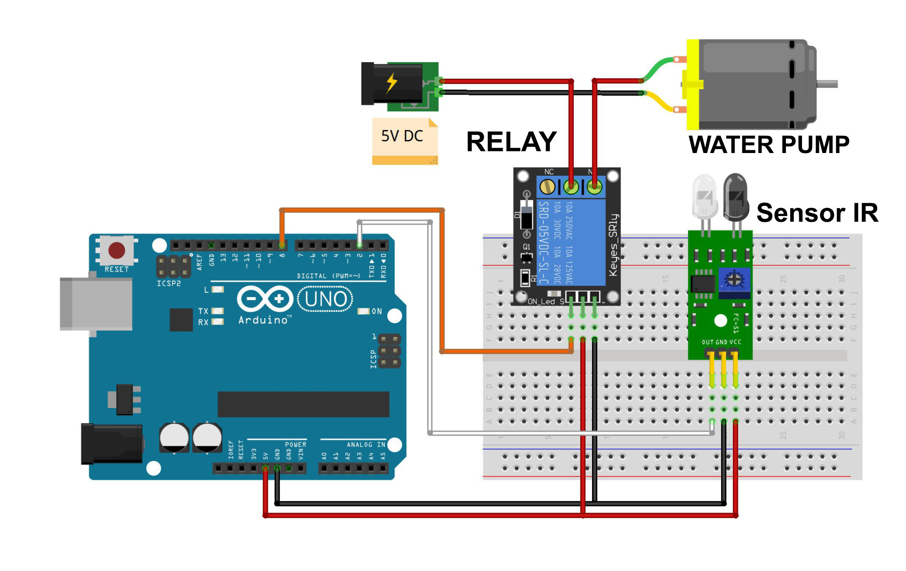

# Washing Place Advanced Hands with Arduino

This project demonstrates an automated hand washing system using Arduino. The system uses a sensor to detect hands under the faucet and controls a water pump to automatically dispense water.

## Components Used

- **Arduino IDE** or Text Editor (e.g., Visual Studio Code)
- **Arduino Uno** (or compatible board) - 1 Unit
- **Infrared Sensor** (or any other suitable proximity sensor) - 1 Unit
- **Water Pump / Motor DC** - 1 Unit
- **Relay 1 Channel Module** - 1 Unit
- **Power Supply** (for Arduino and water pump)
- **Project Board / BreadBoard** - 1 Unit
- **Jumper Wires**

# Schematic:

- Below you can see a schematic image to facilitate the wiring of cables from the microcontroller to devices, both input and output sensors:



## Circuit Diagram

### Wiring Instructions

- **Sensor:**
  - **VCC** to 5V
  - **GND** to GND
  - **Signal** to Digital Pin 2 (D2) on the Arduino
- **Water Pump / Motor DC:**
  - **Control Pin** to Digital Pin 8 (D8) on the Arduino
  - **Power** and **Ground** connected to an external power source if required (ensure the pump voltage matches the power supply).

## Information :

- 5V – VCC IR, VCC Relay
- GND – GND IR, GND Relay
- D2 – Pin Data IR
- D8 – Pin Data Relay
- Com Relay – (+) adapter
- NO Relay – (+) motor DC
- (-) adapter – (-) motor DC

## Work Steps:

- Prepare the tools and materials to be used.
- Carry out the wiring process using Figure schematic of the above circuit.
- Open the Arduino IDE software that has been installed on laptop/computer.
- Download all the libraries above and insert the library by opening the Arduino IDE, selecting Sketch > Include Library -> Add.Zip Library.
- Type the sketch program on the Arduino IDE page.
- Enter the I2C LCD address in the sketch program.
- Carry out the program uploading process.

## Code Explanation

The code continuously reads the state of the sensor connected to pin D2. If the sensor detects hands (LOW state), it activates the water pump by setting pin D8 to LOW, allowing water to flow. When the sensor no longer detects hands (HIGH state), it turns off the pump by setting pin D8 to HIGH.

```cpp
#define sensor 2          // Sensor on pin D2
#define pump 8            // Water pump on pin D8

void setup() {
  pinMode(sensor, INPUT);   // Set sensor as input
  pinMode(pump, OUTPUT);    // Set pump as output
  digitalWrite(pump, HIGH); // Initially turn off the pump
}

void loop() {
  if (digitalRead(sensor) == LOW) {  // If the sensor is LOW (hands detected)
    digitalWrite(pump, LOW);         // Turn on the pump
  } else {                           // If the sensor is HIGH (no hands)
    digitalWrite(pump, HIGH);        // Turn off the pump
  }
}
```

## Installation

    1. Gather all components listed above. <br/>
    2. Connect the components following the wiring instructions. <br/>
    3. Open the Arduino IDE and connect your Arduino board. <br/>
    4. Copy the provided code into the Arduino IDE. <br/>
    4. Upload the code to your Arduino Uno. <br/>

## Usage

- Place your hands under the sensor to activate the water pump and dispense water.
- The water will automatically stop when you remove your hands.

## Conclusion

- This automated hand washing system offers a simple yet effective solution for maintaining hygiene. It is ideal for use in various settings such as kitchens, bathrooms, or public handwashing stations.

- The water pump will turn on when the sensor detects it there are hands.
